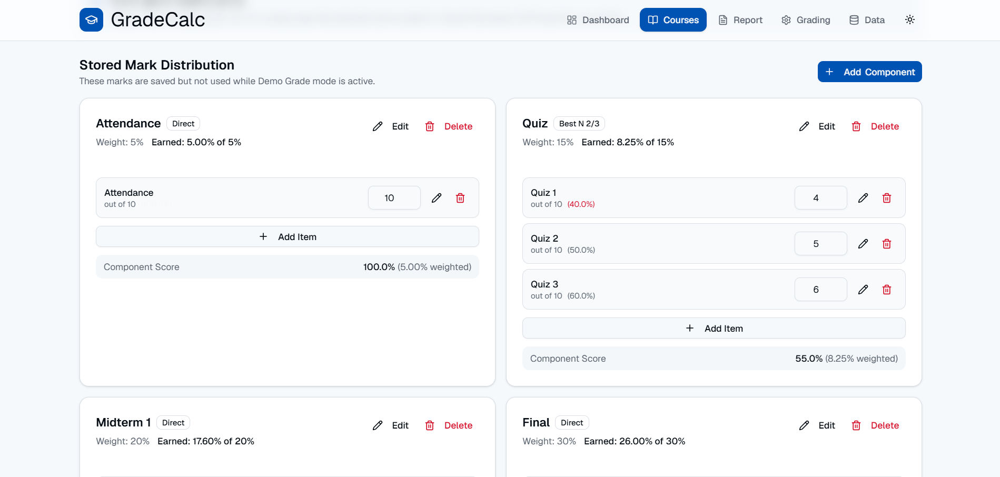
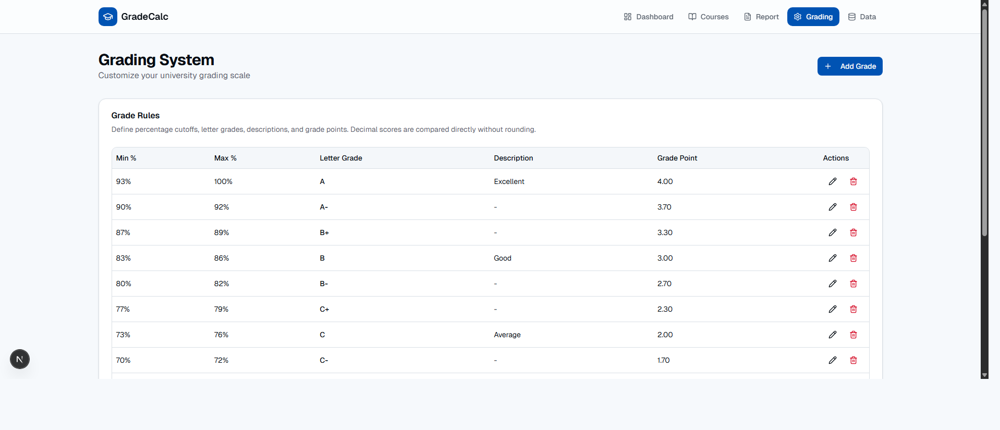
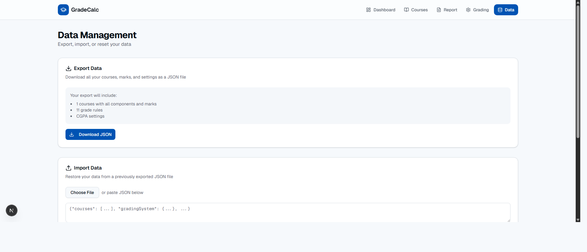

# GradeCalc - Student Grade Calculator

GradeCalc is a web-based student grade calculator built to help users manage courses, marks, grades, and CGPA in one place.
It was made to simplify academic progress tracking without needing spreadsheets or manual calculations.
Students can use it to calculate course results, current semester CGPA, all-time CGPA, and generate grade reports.

## Live Demo

Visit the deployed project here:

https://grade-calc-sigma.vercel.app/

## Features

- Course management
- Marks entry and component-based grading
- Custom grade calculation rules
- Current semester CGPA calculation
- All-time CGPA estimation
- Demo grade mode for expected results
- Customizable grading system
- Semester grade report generation
- CSV report download and print support
- JSON data backup and restore
- Responsive desktop and mobile interface

## Screenshots

### Dashboard
.png)

### Courses
.png)

### Course Details
.png)

### Marks Distribution


### Report
.png)

### Grading System


### Data Management


## Technologies Used

- Next.js
- React
- TypeScript
- Tailwind CSS
- Radix UI
- shadcn-style UI components
- Lucide React
- Recharts
- Next Themes
- Vercel
- localStorage
- HTML
- CSS
- JavaScript
- npm

## Folder Structure

- `app/` - Application routes, pages, layout, and global styles.
- `components/` - Reusable feature components used across the app.
- `components/ui/` - Shared UI components such as buttons, cards, dialogs, inputs, and tables.
- `hooks/` - Custom React hooks for app data, mobile detection, and toast handling.
- `lib/` - Type definitions, grade calculations, localStorage logic, and utility functions.
- `public/` - Static assets such as icons.
- `Screenshots/` - Project UI screenshots used in the README.

## Usage

1. Open the live website or run the project locally.
2. Go to the Courses page and add your course information.
3. Add grading components such as attendance, quizzes, assignments, midterm, and final exam.
4. Enter obtained marks and total marks for each component item.
5. Customize the grading system if your institution uses different grade rules.
6. Check the Dashboard to view total courses, credits, current semester CGPA, and all-time CGPA.
7. Use Demo Grade mode when you want to estimate results without entering full marks.
8. Open the Report page to view, print, or download your semester grade report.
9. Use the Data page to export a backup, import previous data, reset sample data, or clear courses.

## API Endpoints

This project does not use a backend API. It is a frontend-only web application, and all course, marks, grading, and report data is stored in the browser using `localStorage`.

| Method | Endpoint | Description |
|---|---|---|
| N/A | N/A | No API endpoints are available in this project. |

## How to Run the Website Locally

### 1. Install Node.js

Install Node.js if it is not already installed. A recent LTS version is recommended.

### 2. Install Dependencies

From the project folder, run:

```bash
npm install
```

### 3. Start the Development Server

Run:

```bash
npm run dev
```

If you are using Windows PowerShell and see an error about `npm.ps1` or running scripts being disabled, use this command instead:

```bash
npm.cmd run dev
```

You can also run the same command through Command Prompt:

```bash
cmd /c npm run dev
```

### 4. Open the Website

Open this URL in your browser:

```text
http://localhost:3000
```

If port `3000` is already in use, Next.js will show another available local URL in the terminal.

## Build for Production

To create a production build, run:

```bash
npm run build
```

To start the production server after building:

```bash
npm run start
```

## Available Scripts

```bash
npm run dev      # Start the local development server
npm run build    # Create a production build
npm run start    # Start the production server
npm run lint     # Run linting, if ESLint is installed/configured
```

## Project Status

Completed.

## Future Improvements

- User accounts and cloud data sync
- Advanced grade analytics dashboard
- PDF report download
- Multiple semester management
- Course-wise progress charts
- Mobile app or PWA version
- Import marks from CSV files

## Acknowledgements

- Next.js Documentation
- React Documentation
- TypeScript Documentation
- Tailwind CSS Documentation
- Radix UI Documentation
- shadcn/ui component patterns
- Lucide React icons
- Vercel deployment platform

## Notes

- Data is saved only in the browser where the app is used.
- Clearing browser storage may remove saved courses and settings.
- Use the export feature to keep a backup of important grade data.
- The app uses Google-hosted fonts through Next.js, so production builds may need internet access the first time fonts are fetched.
